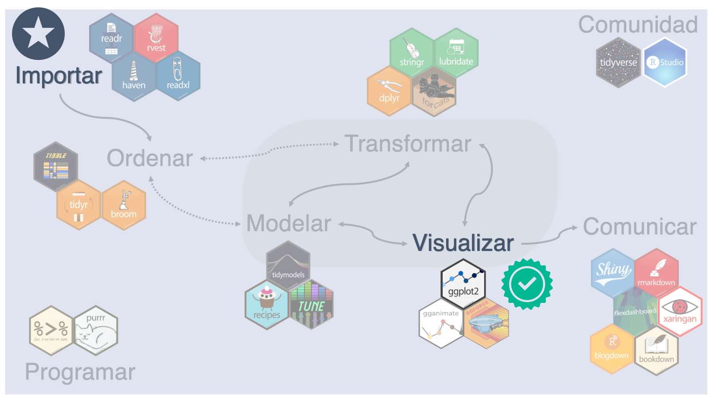
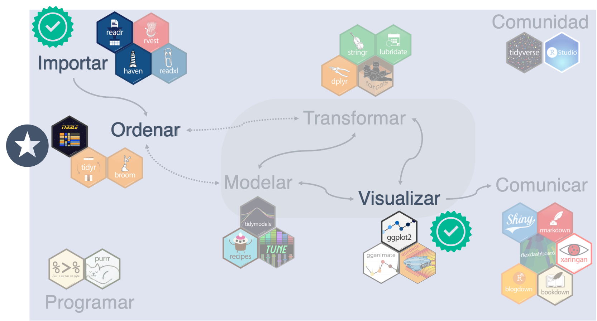

```{r setup, include=FALSE, warning=FALSE}
options(htmltools.dir.version = FALSE)
knitr::opts_chunk$set(fig.retina = 3)

library(xaringanthemer)
library(xaringanExtra)
library(tidyverse)
library(DT)
library(haven)

use_panelset()
style_duo(
  primary_color = rgb(189,195,219,maxColorValue = 255),
  secondary_color = rgb(77,105,133,maxColorValue = 255),
  title_slide_background_color = rgb(77,105,133,maxColorValue = 255),
  title_slide_text_color = rgb(242,242,242,maxColorValue = 255),
  header_color = rgb(65,65,65,maxColorValue = 255),
  inverse_header_color = rgb(242,242,242,maxColorValue = 255)
)
```


background-image: url(img/01_generales/caricatura_ob.jpeg)
background-size: 60%

---
class: inverse, center, middle

# ¿Qué es?

```{r echo=FALSE,out.width = '50%'}
knitr::include_graphics("img/00_hex/tidyverse.png")
```

---
class: left, top
background-image: url(img/01_generales/caricatura_ob.jpeg), url(img/00_hex/tidyverse.png)
background-position: 1% 99%, 99% 1%
background-size: 5%

# ¿Qué es el *tidyverse*?
- Es una colección de paquetes diseñados para ciencia de datos. 
- Comparten una filosofía de diseño, gramática y estructura de datos.
- ¿Un dialecto de R?

```{r echo=FALSE, out.width = '80%', fig.align='center'}

```


---
class: inverse, center, middle
name: ggplot2

# Empecemos con el postre

```{r echo=FALSE,out.width = '40%'}
knitr::include_graphics("img/00_hex/ggplot2.png")
```

```{r eval=FALSE}
library(ggplot2)
```

---

layout: true

background-image: url(img/01_generales/caricatura_ob.jpeg), url(img/00_hex/ggplot2.png)
background-position: 1% 99%, 99% 1%
background-size: 5%

---

### Nuestro objetivo

```{r echo = FALSE, out.width = '90%', fig.retina = 3, fig.align='center'}

```

---
class: left, top

# Gramática de gráficos (gg)

### Idea principal

Un gráfico mapea los valores de una variable en atributos estéticos, dentro de un sistema de coordenadas.

```{r echo = FALSE, out.width='60%', fig.align='center', fig.cap="Fuente: Claus Wilke (Fig. 2.1, https://clauswilke.com/dataviz/)"}
knitr::include_graphics("img/02_visualizar/wilke_fig2_1.png")
```

---
# Gramática de gráficos (gg)

### Construir un gráfico por capas

- Datos
- Geometría
- Mapeos estéticos
- Transformación estadística
- Posición 
- Coordenadas
- Paneles

---

Empecemos por importar el conjunto de datos **evol_covid_combinados.csv**


```{r, include=FALSE}
evol_covid_comb <- read_csv("data/evol_covid_combinados.csv")
```
<br>

```{r, echo=FALSE}
head(evol_covid_comb,15) %>% 
  datatable(fillContainer = FALSE, options = list(pageLength = 5), height = '1px')
```


---

### Nuestro lienzo

```{r lienzo-blanco, fig.show = "hide"}
ggplot()
```

```{r ref.label = "lienzo-blanco", echo = FALSE, out.width="50%"}
```


---

### Agregamos datos

```{r lienzo-blanco-datos, fig.show = "hide"}
ggplot(data = evol_covid_comb)
```

```{r ref.label = "lienzo-blanco-datos", echo = FALSE, out.width="50%"}
```


---

### Primera capa: elegir una geometría

El gráfico más básico puede ser un **diagrama de dispersión**, estamos hablando de **graficar puntos**. 

.panelset[
.panel[.panel-name[Código]
```{r primero-disp, fig.show = "hide"}
ggplot(data = evol_covid_comb) + 
  geom_point(aes(x = n, y = n_acum))
```
]

.panel[.panel-name[Gráfico]
```{r ref.label = "primero-disp", echo = FALSE, out.width="40%", fig.align='center'}
```
]
]

--- 

---

### Atributos estéticos

- Los atributos estéticos más básicos son **x** y **y**.
- ¿Cuáles otros atributos estéticos podemos elegir?

---

### Atributos estéticos

- Los atributos estéticos más básicos son *x* y *y*.
- ¿Cuáles otros atributos estéticos podemos elegir?
- **Color, Forma, Tamaño** de los puntos

.panelset[
.panel[.panel-name[Código]
```{r agrega-color, fig.show = "hide"}
ggplot(data = evol_covid_comb) + 
  geom_point(aes(x = n, y = n_acum, 
                 color = Estadistica))
```
]

.panel[.panel-name[Gráfico]
```{r ref.label = "agrega-color", echo = FALSE, out.width="40%", fig.align='center'}
```
]
]

---

layout: false
class: inverse, center, middle
### ¿Pueden graficar el tipo de registro mediante la forma?

---

layout: true

background-image: url(img/01_generales/caricatura_ob.jpeg), url(img/00_hex/ggplot2.png)
background-position: 1% 99%, 99% 1%
background-size: 5%

---

### Solución: 

Mapear la variable **Registros** en el atributo estético **shape**

.panelset[
.panel[.panel-name[Código]
```{r agrega-forma, fig.show = "hide"}
ggplot(data = evol_covid_comb) + 
  geom_point(aes(x = n, 
                 y = n_acum, 
                 color = Estadistica, 
                 shape = Registros))
```
]

.panel[.panel-name[Gráfico]
```{r ref.label = "agrega-forma", echo = FALSE, out.width="40%", fig.align='center'}
```
]
]

---
layout: false

class: inverse, center, middle
### Ahora intentemos un gráfico de líneas del acumulado por semana coloreadas por estadística.


---

layout: true

background-image: url(img/01_generales/caricatura_ob.jpeg), url(img/00_hex/ggplot2.png)
background-position: 1% 99%, 99% 1%
background-size: 5%

---

### Solución: 

.panelset[
.panel[.panel-name[Pista]
```{r eval=FALSE}
ggplot(data = evol_covid_comb) + 
  geom_****(aes(x = ****, 
                y = n_acum,
                ****))
```
]

.panel[.panel-name[Código]
```{r primero-linea, fig.show = "hide"}
ggplot(data = evol_covid_comb) + 
  geom_line(aes(x = Sem_x, 
                y = n_acum,
                color = Estadistica))
```
]

.panel[.panel-name[Gráfico]

```{r ref.label = "primero-linea", echo = FALSE, out.width="50%", fig.align='center'}
```
]
]

---

### Paneles

Podemos ahora aprender a usar paneles o **facetas**.

.panelset[
.panel[.panel-name[Código]
```{r linea-facet-grid-1, fig.show = "hide"}
ggplot(data = evol_covid_comb) + 
  geom_line(aes(x = Sem_x, 
                y = n_acum,
                color = Estadistica)) + 
  facet_grid(.~Estadistica)
```
]

.panel[.panel-name[Gráfico]

```{r ref.label = "linea-facet-grid-1", echo = FALSE, out.width="50%", fig.align='center'}
```
]
]

---
### Paneles

¿Qué hará **facet_grid(Estadistica ~ .)**?

.panelset[
.panel[.panel-name[Código]
```{r linea-facet-grid-2, fig.show = "hide"}
ggplot(data = evol_covid_comb) + 
  geom_line(aes(x = Sem_x, 
                y = n_acum,
                color = Estadistica)) + 
  facet_grid(Estadistica ~.)
```
]

.panel[.panel-name[Gráfico]

```{r ref.label = "linea-facet-grid-2", echo = FALSE, out.width="40%", fig.align='center'}
```
]
]

---
### Paneles

Cuando hay más categorías **facet_grid()** se vuelve un poco más complicado.
Por eso también existe **facet_wrap()**:

- Permite especificar filas y columnas
- Permite espificar escalas comunes o variables

.panelset[
.panel[.panel-name[Código]
```{r linea-facet-wrap, fig.show = "hide"}
ggplot(data = evol_covid_comb) + 
  geom_line(aes(x = Sem_x, 
                y = n_acum,
                color = Estadistica)) + 
  facet_wrap(~Estadistica, ncol = 1, scales = "free_y")
```
]

.panel[.panel-name[Gráfico]

```{r ref.label = "linea-facet-wrap", echo = FALSE, out.width="30%", fig.align='center'}
```
]
]

---

layout: false 
class: inverse, center, middle
### Hagamos un primer intento por construir nuestro gráfico objetivo

---

layout: true

background-image: url(img/01_generales/caricatura_ob.jpeg), url(img/00_hex/ggplot2.png)
background-position: 1% 99%, 99% 1%
background-size: 5%

---

### ¿Qué características que hemos visto hasta ahora encuentran?

```{r echo = FALSE, out.width = '90%', fig.retina = 3, fig.align='center'}

```

---

### ¿Qué características que hemos visto hasta ahora encuentran?

```{r echo = FALSE, out.width = '50%', fig.retina = 3, fig.align='center'}

```

.pull-left[
**Geometría**: gráfico de barras

**Ejes y vs x**: n vs Sem_x
]

--
.pull-right[
**Color**: Estadística

**Panel**: Estadística
]

---

### Ahí les van dos atributos estéticos extras

```{r echo = FALSE, out.width = '50%', fig.retina = 3, fig.align='center'}

```

.pull-left[
**Geometría**: gráfico de barras

**Ejes y vs x**: n vs Sem_x

**Color**: Estadística

**Panel**: Estadística
]

.pull-right[
**Transparencia**: Sem_x >= 51

**Tipo de línea**: Sem_x >= 51

(Noten que estaríamos transformando también)
]

---

### Primer intento de nuestro gráfico

.panelset[
.panel[.panel-name[Pista]
```{r eval = FALSE}
ggplot(data = evol_covid_comb) + 
  geom_****(aes(x = Sem_x, 
                y = ****,
                **** = Estadistica,
                alpha = ****,
                linetype = ****)) + 
  ****
```
]

.panel[.panel-name[Código]
```{r primer-intento, fig.show = "hide", warning=FALSE}
ggplot(data = evol_covid_comb) + 
  geom_col(aes(x = Sem_x, 
               y = n,
               color = Estadistica,
               alpha = Sem_x < 51,
               linetype = Sem_x < 51)) + 
  facet_wrap(~Estadistica, ncol = 1, scales = "free_y")
```
]

.panel[.panel-name[Gráfico]

Ups...

1. El atributo estético de color se asocia al contorno de la barra, lo que queremos es el **relleno**.
2. R nos advierte que el atributo de transparencia no se aconseja para variables discretas, pero en este caso podemos ignorar la advertencia.

```{r ref.label = "primer-intento", echo = FALSE, out.width="30%", fig.align='center'}
```

]
]

---

### Segundo intento de nuestro gráfico

Ahora intentemos utilizando el atributo de **fill** en lugar de *color*, que queda en negro para ver el contraste.
La pista también incluye la forma de dar una paleta arbitraria de colores de relleno, que en ggplot se llaman **escalas**.

.panelset[
.panel[.panel-name[Pista]
```{r eval = FALSE}
ggplot(data = evol_covid_comb) + 
  geom_col(aes(x = Sem_x, 
               y = n,
               *** = Estadistica,
               alpha = Sem_x < 51,
               linetype = Sem_x < 51), 
           color = "black") +
  facet_wrap(~Estadistica, ncol = 1, scales = "free_y") + 
  scale_***_manual(values = c("#4D6985","#51B597"))
```
]

.panel[.panel-name[Código]
```{r segundo-intento, fig.show = "hide", warning=FALSE}
ggplot(data = evol_covid_comb) + 
  geom_col(aes(x = Sem_x, 
               y = n,
               fill = Estadistica,
               alpha = Sem_x < 51,
               linetype = Sem_x < 51), 
           color = "black") + 
  facet_wrap(~Estadistica, ncol = 1, scales = "free_y") + 
  scale_fill_manual(values = c("#4D6985","#51B597"))
```
]

.panel[.panel-name[Gráfico]

¡Ya se va pareciendo más! Pero ahora casi no se ven las últimas columnas y los tipos de contorno están al revés. 

```{r ref.label = "segundo-intento", echo = FALSE, out.width="30%", fig.align='center',warning=FALSE}
```

]
]

---

### Tercer intento de nuestro gráfico

La tarea ahora es la de agregar la **escala manual de transparencia** para que las columnas oscuras tengan 100% de opacidad y las más recientes 40%. En R podemos expresar el porcentaje de opacidad en decimales. También podemos regresar a que el color del contorno dependa de la estadística y corregir el tipo de contorno.

.panelset[
.panel[.panel-name[Pista]
```{r eval = FALSE}
ggplot(data = evol_covid_comb) + 
  geom_col(aes(x = Sem_x, 
               y = n,
               fill = Estadistica,
               alpha = Sem_x < 51,
               linetype = ****, 
               color = ****)) +
  facet_wrap(~Estadistica, ncol = 1, scales = "free_y") + 
  scale_fill_manual(values = c("#4D6985","#51B597")) + 
  scale_****_manual(values = c(****, ****)) + 
  scale_****_manual(values = c("#4D6985","#51B597")) 
```
]

.panel[.panel-name[Código]
```{r tercer-intento, fig.show = "hide", warning=FALSE}
ggplot(data = evol_covid_comb) + 
  geom_col(aes(x = Sem_x, 
               y = n,
               fill = Estadistica,
               alpha = Sem_x < 51,
               linetype = Sem_x >= 51,
               color = Estadistica)) + 
  facet_wrap(~Estadistica, ncol = 1, scales = "free_y") + 
  scale_fill_manual(values = c("#4D6985","#51B597"))  + 
  scale_alpha_manual(values = c(0.4,1)) + 
  scale_color_manual(values = c("#4D6985","#51B597"))
```
]

.panel[.panel-name[Gráfico]

```{r ref.label = "tercer-intento", echo = FALSE, out.width="30%", fig.align='center',warning=FALSE}
```

]
]

---

### Últimos detalles

Los únicos detalles faltantes son eliminar la leyenda, agregar títulos y cambiar el **tema** general del gráfico para que el fondo no sea gris o no haya líneas verticales. 

--

Los invito a que ese sea su reto hacia adelante. Leer la documentación de **ggplot** para ver qué son los temas y cómo modificar leyendas. Además pueden explorar muchas más geometrías y características. 

--

Pero para que no haya espinita...

---

### Últimos detalles


.panelset[
.panel[.panel-name[Pista]
```{r eval = FALSE}
tercer_intento <- ****

tercer_intento + 
  theme_minimal() + 
  theme(legend.position = "none",
        panel.grid.minor = element_blank(),
        panel.grid.major.x = element_blank()) + 
  labs(title = ****, 
       x = ****)
```
]

.panel[.panel-name[Código]
```{r graf-final, fig.show = "hide", warning=FALSE}
tercer_intento <- ggplot(data = evol_covid_comb) + 
  geom_col(aes(x = Sem_x, 
               y = n,
               fill = Estadistica,
               alpha = Sem_x < 51,
               linetype = Sem_x >= 51,
               color = Estadistica)) + 
  facet_wrap(~Estadistica, ncol = 1, scales = "free_y") + 
  scale_fill_manual(values = c("#4D6985","#51B597"))  + 
  scale_alpha_manual(values = c(0.4,1)) + 
  scale_color_manual(values = c("#4D6985","#51B597")) 

tercer_intento + 
  theme_minimal() + 
  theme(legend.position = "none",
        panel.grid.minor = element_blank(),
        panel.grid.major.x = element_blank()) + 
  labs(title = "Evolución semanal de la pandemia COVID19 en México", 
       x = "Semana epidemiológica")
```
]

.panel[.panel-name[Gráfico]

```{r ref.label = "graf-final", echo = FALSE, out.width="55%", fig.align='center',warning=FALSE}
```

]
]

---
layout: false
class: inverse, center, middle

# ¿Les gustó el postrecito?

```{r echo=FALSE,out.width = '40%'}
knitr::include_graphics("img/00_hex/ggplot2.png")
```

---
class: left, top
background-image: url(img/01_generales/caricatura_ob.jpeg), url(img/00_hex/tidyverse.png)
background-position: 1% 99%, 99% 1%
background-size: 5%

### Ahora sí, sigamos nuestra ruta de ciencia de datos

...por el inicio

```{r echo=FALSE, out.width = '90%', fig.align='center'}

```

---
class: inverse, center, middle

# Importar datos

.pull-left[
```{r echo=FALSE,out.width = '60%'}
knitr::include_graphics("img/00_hex/readr.png")
```
]
.pull-right[
```{r echo=FALSE,out.width = '60%'}

```
]

Consejo: cargar los paquetes al inicio del script.
```{r eval=FALSE}
library(readr) 
library(haven)
```


---

layout: true

background-image: url(img/01_generales/caricatura_ob.jpeg), url(img/00_hex/readr.png)
background-position: 1% 99%, 99% 1%
background-size: 5%

---

### Importar datos con readr

Nos sirve para importar archivos "rectangulares". 
Es decir delimitados por algún separador (coma, tab, punto y coma, espacio, ...)

```{r}
base_covid_1 <- read_csv(file = "data/sub_base_ssa_covid_mex.csv")
```

---

### Importar datos con readr

```{r}
evol_covid_comb <- read_csv(file = "data/evol_covid_combinados.csv",
                            col_types = "dddcc")
```

<br>

```{r, echo=FALSE}
head(evol_covid_comb,15) %>% 
  datatable(fillContainer = FALSE, options = list(pageLength = 5), height = '1px')
```

---

### Ventajas

Es más rápido que las funciones de R base

Sus funciones más consistentes

### Desventajas

Pueden haber soluciones más rápidas aún (p.ej. data.table)

Se deben dar más parámetros (p.ej. locale())

---
layout: true

background-image: url(img/01_generales/caricatura_ob.jpeg), url(img/00_hex/haven.png)
background-position: 1% 99%, 99% 1%
background-size: 5%

---

### Importar datos con haven

Nos sirve para importar archivos de otros formatos como SPSS o SAS.

```{r, warning=FALSE}
base_covid_2 <- read_sav(file = "data/sub_base_Salud_covid19_mex.sav")
base_covid_2[1:10,]
```


---
layout: false
class: inverse

# ¿Notan algo raro?

```{r echo=FALSE, warning=FALSE}
base_covid_2
```

---
class: left, top
background-image: url(img/01_generales/caricatura_ob.jpeg), url(img/00_hex/tidyverse.png)
background-position: 1% 99%, 99% 1%
background-size: 5%

### Empecemos a hablar de pulcritud

```{r echo=FALSE, out.width = '90%', fig.align='center'}

```

---
class: inverse, center, middle

# Importar datos

```{r echo=FALSE,out.width = '60%'}

```

```{r eval=FALSE}
library(tibble)
```

---
layout: true

background-image: url(img/01_generales/caricatura_ob.jpeg), url(img/00_hex/tibble.png)
background-position: 1% 99%, 99% 1%
background-size: 5%

---

### Tibbles

Funcionan como *data frames* pero con algunas diferencias sutiles que los hacen más "pulcros". Por ejemplo, no cambian los tipos de variables ni sus nombres. También permiten trabajar más fácilmente con columnas cuyos elementos son listas. 

.panelset[
.panel[.panel-name[Strings vs Factors]
```{r}
tibble(x = letters[1:5])

# R cambió el default de stringsAsFactors recientemente
```
]

.panel[.panel-name[Nombres]
```{r}
data.frame(`crazy name` = 1)
tibble(`crazy name` = 1)
```
]

.panel[.panel-name[Columnas de listas]
```{r}
tibble(x = 1:3, y = list(1:5, 1:10, 1:20))
```
]
]

---

### El paquete tibble también añadió otra función útil


```{r}
glimpse(base_covid_2)
```


---

layout: false
class: left, top
background-image: url(img/01_generales/caricatura_ob.jpeg), url(img/00_hex/tidyverse.png)
background-position: 1% 99%, 99% 1%
background-size: 5%

### Entremos al corazón del concepto de *tidy data*

```{r echo=FALSE, out.width = '90%', fig.align='center'}

```
---
class: inverse, center, middle

# Datos pulcros

```{r echo=FALSE,out.width = '60%'}

```

```{r eval=FALSE}
library(tidyr)
```

---
layout: true

background-image: url(img/01_generales/caricatura_ob.jpeg), url(img/00_hex/tidyr.svg)
background-position: 1% 99%, 99% 1%
background-size: 5%

---

### Tidy data de la mano de Julia Lowndes y Allison Horst
Imágenes provenientes de su [artículo](https://www.openscapes.org/blog/2020/10/12/tidy-data/) en Openscapes *Tidy Data for reproducibility, efficiency, and collaboration*

```{r echo=FALSE, out.width = '90%', fig.align='center'}
knitr::include_graphics("img/03_tidydata/tidydata_1.jpg")
```

---

### Tidy data de la mano de Julia Lowndes y Allison Horst
Imágenes provenientes de su [artículo](https://www.openscapes.org/blog/2020/10/12/tidy-data/) en Openscapes *Tidy Data for reproducibility, efficiency, and collaboration*

```{r echo=FALSE, out.width = '90%', fig.align='center'}
knitr::include_graphics("img/03_tidydata/tidydata_2.jpg")
```

---

### Tidy data de la mano de Julia Lowndes y Allison Horst
Imágenes provenientes de su [artículo](https://www.openscapes.org/blog/2020/10/12/tidy-data/) en Openscapes *Tidy Data for reproducibility, efficiency, and collaboration*

```{r echo=FALSE, out.width = '90%', fig.align='center'}
knitr::include_graphics("img/03_tidydata/tidydata_3.jpg")
```

---

### Tidy data de la mano de Julia Lowndes y Allison Horst
Imágenes provenientes de su [artículo](https://www.openscapes.org/blog/2020/10/12/tidy-data/) en Openscapes *Tidy Data for reproducibility, efficiency, and collaboration*

```{r echo=FALSE, out.width = '90%', fig.align='center'}
knitr::include_graphics("img/03_tidydata/tidydata_4.jpg")
```

---

### Tidy data de la mano de Julia Lowndes y Allison Horst
Imágenes provenientes de su [artículo](https://www.openscapes.org/blog/2020/10/12/tidy-data/) en Openscapes *Tidy Data for reproducibility, efficiency, and collaboration*

```{r echo=FALSE, out.width = '90%', fig.align='center'}
knitr::include_graphics("img/03_tidydata/tidydata_7.jpg")
```

---

### Ejemplo 

¿Qué observan en estos datos?

.panelset[
.panel[.panel-name[Datos originales]
```{r}
billboard[1:8,1:15]
```
]

.panel[.panel-name[Datos pulcros]
```{r, echo=FALSE}
pivot_longer(billboard, cols = wk1:wk76, names_to = "week", values_to = "rank")
```
]

.panel[.panel-name[2 funciones]

.pull-left[

Versión anterior
```{r echo=FALSE,out.width = '30%'}

```

```{r, eval=FALSE}
gather(data = billboard, 
       key = "week", 
       value = "rank",
       wk1:wk76)
```
]

.pull-right[

Nueva versión
```{r echo=FALSE,out.width = '30%'}
knitr::include_graphics("img/00_hex/tidyr.png")
```

```{r, eval=FALSE}
pivot_longer(data = billboard, 
             cols = wk1:wk76, 
             names_to = "week", 
             values_to = "rank")
```
]

Podemos asignar el nombre de **tidy_billboard** a estos nuevos datos.
]
]

---

layout: true

background-image: url(img/01_generales/caricatura_ob.jpeg), url(img/00_hex/tidyr.svg), url(img/00_hex/tidyr.png)
background-position: 1% 99%, 95% 1%, 99% 1%
background-size: 5%

---

### ¿Podemos regresarnos?

Sí, tanto **gather()** como **pivot_longer()** tienen funciones complementarias.

Versión anterior (complemento de *gather()*)
```{r, eval=FALSE}
spread(data = tidy_billboard, 
       key = "week", 
       value = "rank")
```

Nueva versión (complemento de *pivot_longer()*)
```{r, eval=FALSE}
pivot_wider(data = tidy_billboard, 
            names_from = "week", 
            values_from = "rank")
```

---

layout: false
class: left, top
background-image: url(img/01_generales/caricatura_ob.jpeg), url(img/00_hex/tidyverse.png)
background-position: 1% 99%, 99% 1%
background-size: 5%

### Ahora ya podemos transformar más

```{r echo=FALSE, out.width = '90%', fig.align='center'}

```
---
class: inverse, center, middle

# Transformar datos

```{r echo=FALSE,out.width = '40%'}

```

```{r eval=FALSE}
library(dplyr)
```

---
layout: true

background-image: url(img/01_generales/caricatura_ob.jpeg), url(img/00_hex/dplyr.svg)
background-position: 1% 99%, 99% 1%
background-size: 5%

---

### Idea básica

Hay 5 **verbos** o acciones que nos permiten hacer la mayoría de transformaciones que necesitamos al procesar datos: 

- Filtrar casos
- Ordenar casos
- Seleccionar variables
- Crear variables
- Resumir variables

--

#### Para mí, esto es el **motor** del *tidyverse*

--
Estos *verbos* van a compartir una **sintáxis**

```{r eval=FALSE}
verbo(data = *tibble*, ...) -> **nuevo tibble**
```

---

### Para presentarlos usemos los datos de Covid

```{r, eval=FALSE}
head(evol_covid_comb,15)
```

<br>

```{r, echo=FALSE}
head(evol_covid_comb,15) %>% 
  datatable(fillContainer = FALSE, options = list(pageLength = 5), height = '1px')
```

---

### Filtrar casos: **filter**

Por ejemplo, podemos estar interesados solamente en analizar las defunciones. 
Tenemos entonces que **filtrar** la base a aquellos casos que en la variable *Estadistica* tienen el valor de "Defunciones".

.panelset[
.panel[.panel-name[Objetivo]

```{r echo=FALSE}

```

]

.panel[.panel-name[Función]

Ingresamos los datos como primer parámetro y damos la condición del filtro. 

```{r eval=FALSE}
filter(evol_covid_comb, Estadistica == "Defunciones")
```

Podríamos asignar el resultado a un nuevo *tibble* llamado **evol_covid_def**.

]

.panel[.panel-name[evol_covid_def]

```{r echo=FALSE}
evol_covid_def <- filter(evol_covid_comb, Estadistica == "Defunciones")
evol_covid_def
```

]
]

---

### Ordenar casos: **arrange**

Recordemos que nuestros datos están desordenados. 
Probablemente querríamos que siguieran un orden cronológico ascendente. 

.panelset[
.panel[.panel-name[Objetivo]

```{r echo=FALSE}

```

]

.panel[.panel-name[Función]

Ingresamos los datos como primer parámetro y damos la variable por la que queremos ordenar

```{r eval=FALSE}
arrange(evol_covid_def, Sem_x)
```

Si quisiéramos ordenar de manera descendente, agregamos la cláusula **desc()**

```{r eval=FALSE}
arrange(evol_covid_def, desc(Sem_x))
```

]

.panel[.panel-name[Resultado ascendente]

```{r echo=FALSE}
arrange(evol_covid_def, Sem_x)
```

]

.panel[.panel-name[Resultado descendente]

```{r echo=FALSE}
arrange(evol_covid_def, desc(Sem_x))
```

]

]

---

### Seleccionar variables: **select**

Supongamos que nos interesan las columnas *Estadistica*, *Sem_x* y *n*. 

.panelset[
.panel[.panel-name[Objetivo]

```{r echo=FALSE}

```

]

.panel[.panel-name[Función]

Ingresamos los datos como primer parámetro y damos las columnas seleccionadas separadas por comas.

```{r eval=FALSE}
select(evol_covid_def, Estadistica, Sem_x, n)
```

Si quisiéramos *deseleccionar*, agregamos el prefijo **-**

```{r eval=FALSE}
select(evol_covid_def,-n_acum,-Registros)
```

]

.panel[.panel-name[Resultado]

```{r echo=FALSE}
select(evol_covid_def, Estadistica, Sem_x, n)
```

]

.panel[.panel-name[Deseleccionando]

```{r echo=FALSE}
select(evol_covid_def,-n_acum,-Registros)
```

]

]

---

### Crear variables: **mutate**

¿Qué tal que queremos una variable de **Año**? Podemos construirla a partir de la semana

.panelset[
.panel[.panel-name[Objetivo]

```{r echo=FALSE}

```

]

.panel[.panel-name[Función]

Ingresamos los datos como primer parámetro y calculamos la nueva variable.

```{r eval=FALSE}
mutate(evol_covid_def, 
       Año = ifelse(evol_covid_def$Sem_x <= 52, 2020, 2021))
```

]

.panel[.panel-name[Resultado]

```{r echo=FALSE}
mutate(evol_covid_def, Año = ifelse(evol_covid_def$Sem_x <= 52, 2020, 2021)) %>% 
  arrange(desc(Sem_x)) %>% 
  head(15) %>% 
  datatable(fillContainer = FALSE, options = list(pageLength = 5), height = '1px')
```

]


]

---

### Resumir variables: **summarise**

El cálculo de resúmenes estadísticos es fundamental en la ciencia de datos.
De hecho, el estadístico Stephen Stigler lo considera como el *primer pilar de la sabiduría estadística* en uno de sus recientes [libros](https://www.goodreads.com/book/show/27311742-the-seven-pillars-of-statistical-wisdom).

Por ejemplo, podemos obtener información útil con preguntas como

¿Cuánto fue el acmé semanal de defunciones?

¿Cuánto ha sido el promedio de defunciones semanales?

.panelset[
.panel[.panel-name[Objetivo]

```{r echo=FALSE}

```

]

.panel[.panel-name[Función]

Ingresamos los datos como primer parámetro y calculamos los resúmenes.

```{r eval=FALSE}
summarise(evol_covid_def, 
          Max = max(n),
          Promedio = mean(n))
```

]

.panel[.panel-name[Resultado]

```{r echo=FALSE}
summarise(evol_covid_def, 
          Max = max(n),
          Promedio = mean(n))
```

]


]

---

layout: false
class: inverse, center, middle

# Estos fueron los 5 verbos básicos

---
layout: true

background-image: url(img/01_generales/caricatura_ob.jpeg), url(img/00_hex/dplyr.svg)
background-position: 1% 99%, 99% 1%
background-size: 5%

---

### Analizar por grupos

Además de los 5 verbos básicos, muchas veces queremos aplicar las mismas operaciones por grupos. Por ejemplo, podríamos querer calcular el acmé y promedio tanto de defunciones como de casos. 

Para ello existe la función **group_by()**, que recibe un *tibble* y regresa un *tibble agrupado* al que se le aplicarán funciones por grupos, ya sea via *summarise()* o *mutate()*. 

```{r echo=FALSE}

```

---

.panelset[

.panel[.panel-name[Función]

Ingresamos los datos como primer parámetro y damos la variable de agrupación. 

```{r}
evol_covid_agrupado <- group_by(evol_covid_comb,Estadistica)
evol_covid_agrupado
```

]

.panel[.panel-name[Resumir]

```{r}
summarise(evol_covid_agrupado, 
          Max = max(n),
          Promedio = mean(n))
```

]

.panel[.panel-name[Crear variable]

```{r}
mutate(evol_covid_agrupado, 
       Max = max(n),
       Promedio = mean(n))
```

]

]

---

layout: false
class: inverse, left, top

# Y aquí vendrá una idea nueva 

### Normalmente queremos concatenar operaciones. 

.pull-left[
Por ejemplo: 

1. Filtrar, 
2. y luego seleccionar,
3. y luego agrupar, 
4. y luego resumir.
]

--
.pull-right[

```{r echo=FALSE, out.width="60%"}
knitr::include_graphics("img/00_hex/pipe.png")
```
]

--

### Va a parecer magia

---
layout: true

background-image: url(img/01_generales/caricatura_ob.jpeg), url(img/00_hex/pipe.png)
background-position: 1% 99%, 99% 1%
background-size: 5%

---

### ¿Qué hace el código?

.panelset[

.panel[.panel-name[Código]
```{r eval=FALSE}
base_covid_2 %>% 
  select(ENTIDAD_UM, SEXO, FECHA_DEF, CLASIFICACION_FINAL) %>% 
  mutate(SEXO = ifelse(SEXO == "1","F","M"),
         COVID = ifelse(CLASIFICACION_FINAL %in% c("1","2","3"),
                        "Positivo","Negativo")) %>% 
  filter(!is.na(FECHA_DEF)) %>% 
  group_by(ENTIDAD_UM,SEXO,COVID) %>% 
  summarise(X = n())
```
]

.panel[.panel-name[Resultado]
```{r echo=FALSE}
base_covid_2 %>% 
  select(ENTIDAD_UM, SEXO, FECHA_DEF, CLASIFICACION_FINAL) %>% 
  mutate(SEXO = ifelse(SEXO == "1","F","M"),
         COVID = ifelse(CLASIFICACION_FINAL %in% c("1","2","3"),
                        "Positivo","Negativo")) %>% 
  filter(!is.na(FECHA_DEF)) %>% 
  group_by(ENTIDAD_UM,SEXO,COVID) %>% 
  summarise(X = n())
```
]
]

---

layout: false
class: left, top
background-image: url(img/01_generales/caricatura_ob.jpeg), url(img/00_hex/tidyverse.png)
background-position: 1% 99%, 99% 1%
background-size: 5%

### ¿Dónde vamos hasta ahora?

```{r echo=FALSE, out.width = '90%', fig.align='center'}

```

---

layout: false
class: inverse, left, top

### ¿Qué sigue? 

Una ruta completa con algunas otras lecciones de transformación

```{r echo=FALSE, out.width = '50%', fig.align='center'}
knitr::include_graphics("img/00_hex/tidyverse.png")
```
